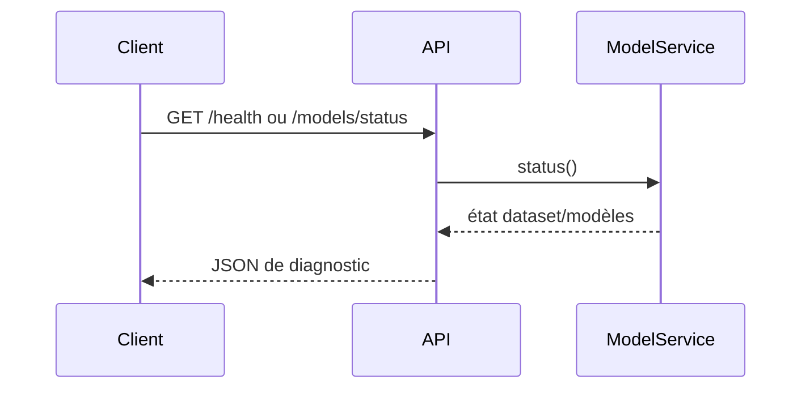
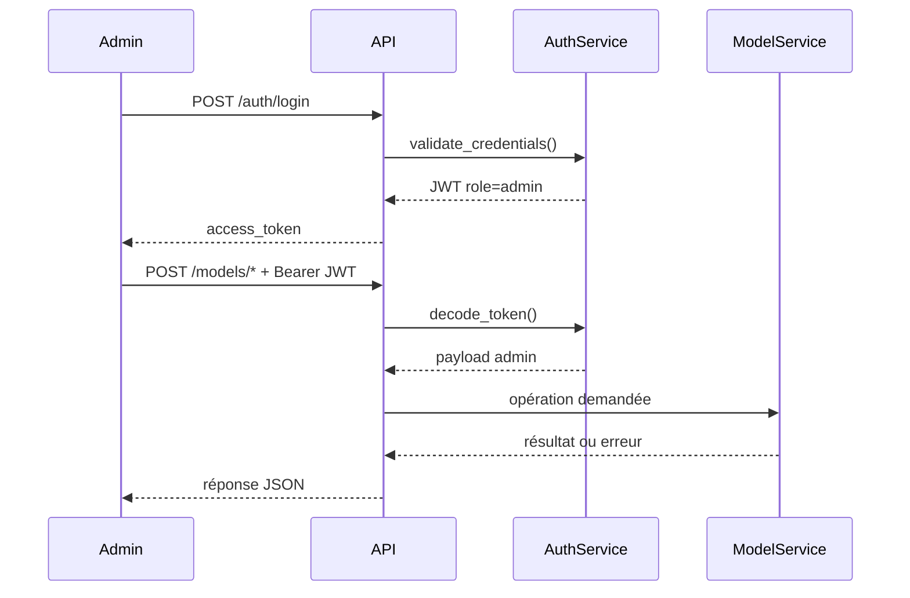
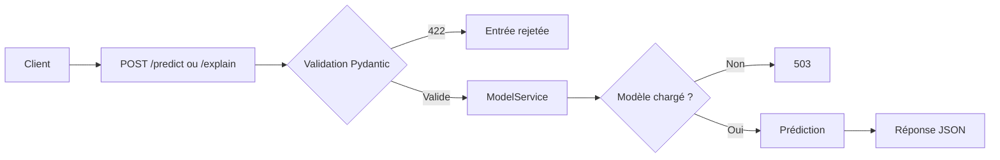

# API Meaningful Connectivity

Documentation de l'API FastAPI du projet Meaningful Connectivity. Cette API expose l'état du service, l'authentification administrateur, l'inférence des modèles et leur couche d'explicabilité.

> Cette documentation décrit le comportement actuellement implémenté dans le dépôt. Les endpoints d'entraînement et d'explication sont donc documentés avec leurs limites actuelles.

## 1. Vue d'ensemble

- **Framework** : FastAPI
- **Version déclarée** : `0.1.0` dans `api/main.py`
- **Documentation interactive** : `/docs`
- **Schéma OpenAPI** : `/openapi.json`
- **Authentification** : JWT signé en HS256
- **Rôle disponible** : `admin`
- **Modèles supportés** : `logistic_regression`, `random_forest`, `gradient_boosting`
- **Cible** : classification `meaningful` / `not meaningful`

L'application assemble les routeurs suivants :

| Domaine | Préfixe | Authentification |
|---|---|---|
| Système | `/` | Aucune |
| Authentification | `/auth` | Aucune pour la connexion |
| Santé | `/health` | Aucune |
| Prédiction | `/predict` | Aucune actuellement |
| Explicabilité | `/explain` | Aucune actuellement |
| Modèles | `/models` | Lecture publique pour le statut ; admin pour les opérations d'administration |

## 2. Démarrage

Depuis la racine du projet :

```bash
uvicorn api.main:app --reload
```

L'API sera disponible par défaut à `http://127.0.0.1:8000`.

Pour consulter l'interface Swagger :

```text
http://127.0.0.1:8000/docs
```

## 3. Authentification et autorisations

### 3.1 Connexion administrateur

`POST /auth/login` vérifie un identifiant administrateur puis crée un JWT.

Requête JSON :

```json
{
  "username": "admin",
  "password": "mot-de-passe"
}
```

Réponse `200 OK` :

```json
{
  "access_token": "<jwt>",
  "token_type": "bearer",
  "expires_in": 3600,
  "role": "admin"
}
```

Échec : `401 Unauthorized` avec le détail `Identifiants invalides.`.

### 3.2 Configuration des identifiants

Les paramètres sont lus au démarrage via les variables d'environnement :

| Variable | Valeur par défaut | Utilisation |
|---|---|---|
| `API_JWT_SECRET` | `change-me-in-production` | Clé de signature JWT |
| `API_JWT_TTL_SECONDS` | `3600` | Durée de validité du token |
| `ADMIN_USERNAME` | `admin` | Nom d'utilisateur administrateur |
| `ADMIN_PASSWORD_HASH` | non défini | Hash bcrypt du mot de passe |
| `ADMIN_PASSWORD` | non défini | Mot de passe en clair, utilisé seulement si aucun hash n'est configuré |

En production, il faut remplacer le secret par défaut et préférer `ADMIN_PASSWORD_HASH` à `ADMIN_PASSWORD`.

### 3.3 Utilisation du token

Pour les routes protégées, envoyer le JWT dans l'en-tête HTTP :

```http
Authorization: Bearer <jwt>
```

La dépendance `require_admin` :

1. vérifie la présence du token ;
2. vérifie sa signature, son algorithme et son expiration ;
3. vérifie que la claim `role` vaut `admin`.

Erreurs d'autorisation :

- `401 Unauthorized` : token absent, invalide ou expiré ;
- `403 Forbidden` : token valide mais rôle différent de `admin`.

## 4. Routes

### `GET /`

Retourne les informations générales et les principaux chemins de l'API.

Réponse `200 OK` :

```json
{
  "name": "Meaningful Connectivity API",
  "version": "0.1.0",
  "documentation": "/docs",
  "endpoints": {
    "auth": "/auth/login",
    "health": "/health",
    "prediction": "/predict",
    "explainability": "/explain",
    "models": "/models"
  }
}
```

### `GET /health`

Route publique de supervision. Elle indique si le dataset et les modèles sont disponibles en mémoire.

Réponse :

```json
{
  "status": "ok",
  "dataset_loaded": false,
  "dataset_available": false,
  "models_loaded": 0,
  "active_model": null,
  "model_version": null,
  "error": "Dataset non chargé ou modèle non entraîné."
}
```

`status` vaut actuellement `ok` même lorsque les modèles ne sont pas chargés ; les champs `models_loaded`, `active_model` et `error` doivent donc être consultés pour connaître l'état ML réel.

### `POST /predict`

Effectue une prédiction avec un modèle chargé. La route est publique dans l'implémentation actuelle.

Corps JSON :

```json
{
  "model": "gradient_boosting",
  "bandwidth": 2.5,
  "concurrent_users": 4,
  "deadline_seconds": 10,
  "interaction_level": 0,
  "jitter": 12.3,
  "latency": 85.0,
  "packet_loss": 1.2,
  "resource_size_mb": 3.4,
  "service_type": "pdf"
}
```

Champs et contraintes :

| Champ | Type | Contraintes / unité |
|---|---|---|
| `model` | chaîne | `logistic_regression`, `random_forest` ou `gradient_boosting` |
| `bandwidth` | nombre | `>= 0`, Mbit/s |
| `concurrent_users` | entier | `>= 0` |
| `deadline_seconds` | nombre | `> 0`, secondes |
| `interaction_level` | entier | `>= 0` |
| `jitter` | nombre | `>= 0`, millisecondes |
| `latency` | nombre | `>= 0`, millisecondes |
| `packet_loss` | nombre | de `0` à `100`, pourcentage |
| `resource_size_mb` | nombre | `>= 0`, MB |
| `service_type` | chaîne | non vide |

Réponse lorsque le modèle est disponible :

```json
{
  "model": "gradient_boosting",
  "prediction": 1,
  "meaningful": true,
  "probability_meaningful": 0.91,
  "model_version": "loaded-from-disk"
}
```

Erreurs :

- `422 Unprocessable Entity` : corps invalide ou contrainte Pydantic non respectée ;
- `503 Service Unavailable` : modèle absent, non entraîné ou indisponible.

### `POST /explain`

Retourne une prédiction accompagnée d'une liste de contributions par feature. Le corps est identique à celui de `/predict`.

Réponse actuelle :

```json
{
  "model": "gradient_boosting",
  "prediction": {
    "model": "gradient_boosting",
    "prediction": 1,
    "meaningful": true,
    "probability_meaningful": 0.91,
    "model_version": "loaded-from-disk"
  },
  "base_value": 0.0,
  "explanation": [
    {
      "feature": "bandwidth",
      "value": 2.5,
      "shap_value": 0.0
    }
  ],
  "model_version": "loaded-from-disk"
}
```

Limite actuelle : la structure est prête pour l'explication SHAP, mais `api/model_service.py` renvoie actuellement `base_value: 0.0` et `shap_value: 0.0` pour chaque feature. Ce endpoint ne doit donc pas encore être interprété comme une explication SHAP calculée.

Erreurs : mêmes règles que `/predict` (`422` pour l'entrée, `503` si le modèle est indisponible).

### `GET /models/status`

Route publique de diagnostic des modèles. Elle renvoie notamment :

- `dataset_loaded` et `dataset_exists` ;
- le chemin du dataset ;
- le nombre et la liste des modèles chargés ;
- le modèle actif ;
- la version courante ;
- la dernière erreur éventuelle.

### `POST /models/train`

Route réservée à `admin`.

Les paramètres sont actuellement des paramètres de requête, et non un corps JSON :

```bash
curl -X POST \
  'http://127.0.0.1:8000/models/train?dataset_path=%2Fchemin%2Fdataset.csv&model_names=gradient_boosting&model_names=random_forest' \
  -H 'Authorization: Bearer <jwt>'
```

Paramètres :

- `dataset_path` : chemin du fichier dataset ; obligatoire pour que l'appel puisse continuer ;
- `model_names` : liste facultative de modèles, sinon tous les modèles disponibles sont sélectionnés.

Comportement actuel :

1. le chemin est vérifié ;
2. `dataset_loaded` et `dataset_path` sont mis à jour si le fichier existe ;
3. les noms de modèles sont validés ;
4. la route renvoie actuellement `503`, car l'entraînement effectif n'est pas encore implémenté dans `ModelService.train`.

Codes possibles : `401`, `403`, `404` si le dataset est introuvable, `400` si un modèle est inconnu, `503` si l'entraînement n'est pas disponible.

### `POST /models/load`

Route admin. Recharge les modèles disponibles depuis `models/artifacts/` et renvoie l'état du service.

Dans la version actuelle, `ModelService._load_saved_models()` est appelé à l'initialisation du service ; cette route renvoie le statut courant mais ne déclenche pas elle-même un nouveau chargement.

### `POST /models/reload`

Route admin. Même comportement actuellement : elle renvoie le statut courant, sans rechargement effectif supplémentaire.

### `POST /models/save`

Route admin. Demande la sauvegarde de la version courante des modèles.

La route délègue à `model_service.save_models()`, mais cette méthode n'est pas présente actuellement dans `api/model_service.py`. En l'état, un appel authentifié provoque donc une erreur serveur `500` au lieu de produire une réponse fonctionnelle. Le schéma déclaré pour la réponse est :

```json
{
  "saved": true,
  "model_version": "...",
  "path": "...",
  "models": ["gradient_boosting"]
}
```

## 5. Schémas et validation

Les requêtes de prédiction et d'explication utilisent `PredictionRequest` et `ExplainRequest`. `ExplainRequest` reprend exactement les champs de `PredictionRequest`.

Pydantic valide les types et les bornes avant l'appel au service. Une entrée invalide est rejetée automatiquement par FastAPI avec `422`; le service ML n'est donc pas appelé.

## 6. Workflow nominal

### Consultation et diagnostic



### Authentification puis administration



### Inférence



En pratique, le workflow nominal est :

1. démarrer l'API ;
2. consulter `/health` ou `/models/status` ;
3. obtenir un JWT avec `/auth/login` si une opération admin est nécessaire ;
4. entraîner, charger ou sauvegarder les modèles via `/models/*` ;
5. appeler `/predict` pour une classification ;
6. appeler `/explain` pour la structure d'explication actuellement disponible.

## 7. Exemple complet

```bash
TOKEN=$(curl -s -X POST http://127.0.0.1:8000/auth/login \
  -H 'Content-Type: application/json' \
  -d '{"username":"admin","password":"mot-de-passe"}' \
  | python -c 'import json,sys; print(json.load(sys.stdin)["access_token"])')

curl -s http://127.0.0.1:8000/health

curl -s -X POST http://127.0.0.1:8000/predict \
  -H 'Content-Type: application/json' \
  -d '{
    "model":"gradient_boosting",
    "bandwidth":2.5,
    "concurrent_users":4,
    "deadline_seconds":10,
    "interaction_level":0,
    "jitter":12.3,
    "latency":85.0,
    "packet_loss":1.2,
    "resource_size_mb":3.4,
    "service_type":"pdf"
  }'
```

## 8. Sécurité et points d'attention

- Le secret JWT par défaut ne doit jamais être utilisé en production.
- Les mots de passe doivent être fournis via l'environnement ; `ADMIN_PASSWORD_HASH` est préférable au mot de passe en clair.
- `/predict` et `/explain` sont publics actuellement : toute exposition réseau doit donc être protégée par une couche d'accès adaptée si ces routes ne doivent pas être publiques.
- Le JWT contient le rôle `admin`, mais il n'existe pour l'instant qu'un seul niveau d'autorisation.
- Les chemins de dataset sont fournis par l'appelant admin ; ils doivent être contrôlés dans un environnement multi-utilisateur.
- Le statut HTTP `200` de `/health` ne signifie pas nécessairement qu'un modèle est prêt à servir des prédictions.

## 9. Tests existants

`tests/test_api.py` vérifie notamment :

- le retour nominal de `/health` ;
- le rejet d'une bande passante négative par `/predict` ;
- l'échec propre de `/models/train` avec un dataset absent ;
- l'échec propre de `/explain` lorsqu'aucun modèle n'est chargé.

Exécution :

```bash
pytest -q
```
